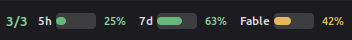
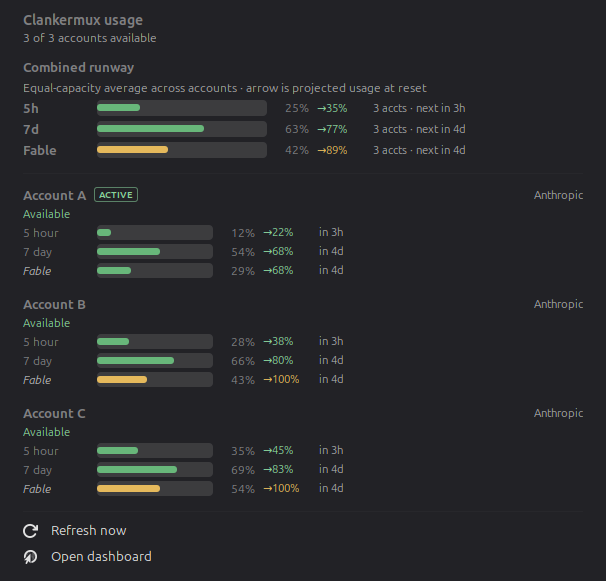

# Clankermux Usage for Cinnamon

[](https://github.com/d4rken/clankermux-mint-applet/actions/workflows/ci.yml)
[](LICENSE)

A native Linux Mint/Cinnamon panel applet for monitoring the accounts behind a
[Clankermux](https://github.com/d4rken/clankermux) proxy.





The panel shows the number of routable accounts followed by combined progress
bars for the 5-hour, 7-day, and model-specific quota pools. For example:

```text
4/4  5h [  5%]  7d [ 49%]  Fable [ 67%]
```

Unused model-specific quota families are omitted from the panel to conserve
space, but remain available in the clicked details. Core 5-hour and 7-day
meters remain visible at 0%.

Each percentage is the equal-capacity average across the accounts that expose
that quota: `sum(account usage %) / account count`. The unfilled portion is the
combined runway still available. Click the applet for:

- 5-hour and 7-day usage bars for every account
- model-specific weekly limits such as Fable
- reset countdowns
- current load-balancer account, paused/token/rate-limit state, provider overloads, and stale-data state
- the last successful refresh time, so stale widget data is easy to spot
- manual refresh and a shortcut to the Clankermux dashboard

When Clankermux observes an upstream provider overload, the availability count
gains an hourglass, for example `0/4 ⏳`. The popup reports the affected provider,
account count, and cooldown, and each affected account shows its retry countdown.
This is based on Clankermux's live 529 cooldown signal, not the provider's broader
public incident status page.

Bar colors are based on projected *combined* pool usage at each account's
reset, using Clankermux predictions where available and reset-paced estimates
for scoped limits:

- green: the combined pool is forecast to remain comfortably below exhaustion
- orange: combined projected usage has crossed the configurable warning level
- red: every account in that quota pool is confidently forecast to exhaust

One account being at risk does not make a combined bar orange or red; spare
accounts are the point of pooling. Individual risk remains visible in the
clicked details.

## Install

```sh
make install
```

Then open **System Settings → Applets**, select **Clankermux Usage**, and click
the `+` button. If it does not appear immediately, press <kbd>Alt</kbd>+<kbd>F2</kbd>,
enter `r`, and press <kbd>Enter</kbd> to reload Cinnamon (X11), or log out and in.

The default server is a Clankermux instance on the same machine:

```text
http://127.0.0.1:8080
```

Right-click the applet and choose **Configure** to enter a different hostname,
IP address, or complete HTTP/HTTPS URL. The settings window also controls the
polling interval, panel bars, warning level, and scoped-limit visibility.

## API and security

The applet performs two unauthenticated read-only requests per refresh:

- `GET /health?detail=1`
- `GET /api/accounts`

The default refresh interval is 30 seconds. Clankermux exposes these management
routes without authentication, so keep port 8080 on a trusted network. If the
server is not directly reachable, create an SSH tunnel and configure the applet
to use its local endpoint, for example:

```sh
ssh -N -L 18080:127.0.0.1:8080 your-proxy-host
```

Then set the server URL to `http://127.0.0.1:18080`.

## Development

No third-party dependencies are required. Run the checks with:

```sh
make check test
```

## License

Licensed under the [GNU General Public License v3.0](LICENSE).
